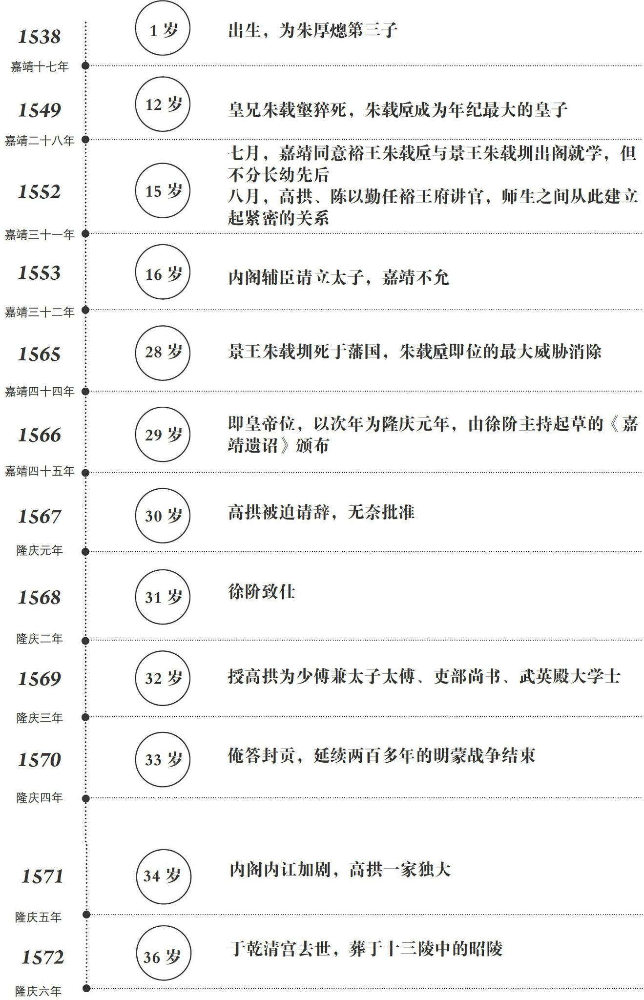

+++

title = "明朝那些事儿"

toc = true

tocNum = false
date = "2025-07-06T20:41:06+08:00"
tags = ["明朝", "当年明月",  "历史"]
displayModifiedDate = false
align = "justify"

+++

### 明十六帝大事记

#### 太祖-朱元璋-洪武

一代猛人，不必多说；马皇后

#### 惠宗-朱允炆-建文

去向成谜。方孝孺、黄子澄等气节无敌

#### 成祖-朱棣-永乐

永乐大典；解缙

#### 仁宗-朱高炽-洪熙

仁德；胖子；好圣孙

#### 宣宗-朱瞻基-宣德

仁宣之治；三杨内阁（杨溥、杨荣、杨士奇）

#### 英宗-朱祁镇-正统-天顺

土木堡之变；二度登基；废除殉葬；人格魅力；王振

#### 代宗-朱祁钰-景泰

于谦，粉骨碎身浑不怕，要留清白在人间

#### 宪宗-朱见深-成化

万妃大宪宗17岁

#### 孝宗-朱佑樘-弘治

童年苦难早熟；弘治中兴；李公谋、刘公断、谢公尤侃侃（李东阳、刘健、谢迁，弘治三阁臣）

#### 武宗-朱厚照-正德

宠坏；聪明；贪玩；八虎（刘瑾等）；宁王叛乱；唐伯虎；王阳明（龙场悟道；此心光明亦复何言）

#### 世宗-朱厚熜-嘉靖

大礼议；杨廷和；张璁；胡宗宪；俞大猷；戚继光；沈炼；严嵩；徐海、汪直；海瑞；徐阶；修仙；二龙不相见

#### 穆宗-朱载垕-隆庆

隆庆新政；高拱

#### 神宗-朱翊钧-万历

在位48年，前期励精图治，万历15年后不上朝（戚继光、海瑞死）；张居正（愿以深心奉尘刹，不予自身求利益；工与谋国拙于谋身；吾非相乃摄也；一条鞭法）；不喜长子；万历三大征；李成梁；李如松

#### 光宗-朱常洛-泰昌

宫女所生；红丸案

#### 熹宗-朱由校-天启

木匠皇帝；东林党辅佐上位；魏忠贤专权；孙承宗

#### 思宗-朱由检-崇祯

灭魏忠贤；恨结党；袁承焕；曹文诏；卢象昇；杨嗣昌；孙传庭；洪承畴、祖大寿；天子守国门，君王死社稷；诸臣误朕，任贼分尸勿伤百姓一人；勤政

### 附：各朝代纪年

