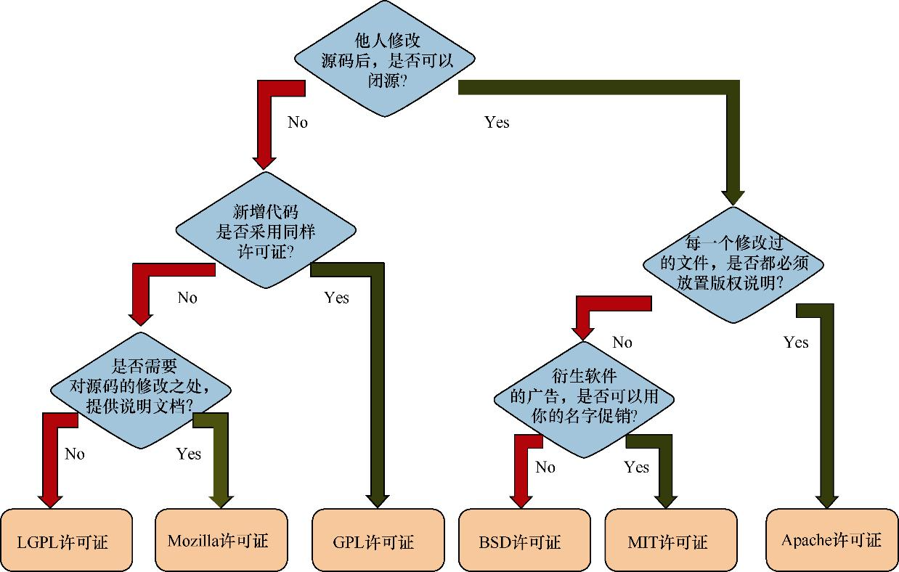

+++

title = "软件许可证一览"

toc = true

tocNum = false

linkTitle = "软件许可证一览"
date = "2025-07-09T22:23:06+08:00"
tags = ["license", "软件许可证",  "Apache License", "GPL"]
displayModifiedDate = false
align = "justify"

+++

| 许可证类型 | 版权约束 | 商业友好性 | 源代码开源要求           | 衍生作品许可证要求       | 是否需注明原作者版权 |
| ---------- | -------- | ---------- | ------------------------ | ------------------------ | -------------------- |
| GPL        | 强       | 中         | 必须                     | 必须相同                 | 是                   |
| LGPL       | 中等     | 高         | 动态链接无需，修改源码需 | 修改源码必须相同         | 是                   |
| Mozilla    | 中等     | 较高       | 修改部分必须开源         | 修改部分相同，其他无要求 | 是，修改处需注明     |
| Apache     | 弱       | 非常高     | 无强制要求               | 无强制要求               | 是                   |
| MIT        | 极弱     | 非常高     | 无强制要求               | 无强制要求               | 是                   |
| BSD        | 弱       | 非常高     | 无强制要求               | 无强制要求               | 是，且不可用于促销   |

### 1. GPL（通用公共许可证）

**核心特点**：

- 非常严格的开源许可证。
- 你修改或基于GPL软件开发的程序，都必须同样使用GPL协议开源发布。
- 任何使用了GPL代码的软件，如果要分发，就必须同时提供源代码。

**实际场景举例**：
 Linux内核就是GPL协议的经典案例。如果某公司使用了Linux内核进行修改，制作出新的操作系统版本，那么该公司发布这个新版本时，必须同时公开修改后的源代码，也必须使用GPL许可证发布。这种许可证保护原始开发者权益，确保代码永远开源。

### 2. LGPL（宽通用公共许可证）

**核心特点**：

- GPL的宽松版本，专门为程序库设计。
- 如果你修改了LGPL许可的库，修改部分必须开源；但你开发的主程序无需开源。
- 只要以动态链接方式调用LGPL的库，主程序可以闭源发布。

**实际场景举例**：
 例如，一个公司开发了闭源的商业软件，用于音视频处理，软件中使用了FFmpeg库（LGPL许可证）。只要公司采用动态链接调用FFmpeg，就无需开源自家的整个软件，仅需公布对FFmpeg本身做的修改。这有利于商业软件的广泛使用LGPL许可的开源库。

### 3. Apache License 2.0（Apache许可证）

**核心特点**：

- 对商业非常友好，约束较少。
- 基于Apache许可证的软件可随意修改并再发布，无需开源自己软件的源代码。
- 但必须在发布时注明原作者的版权和许可声明。

**实际场景举例**：
 著名的大数据框架Hadoop和Kafka都使用了Apache许可证。公司或个人基于Kafka开发商业产品时，无需公布自己产品的源代码，但在发布产品时必须注明“本产品使用了Apache Kafka”等版权声明。这使得Apache许可证的软件更容易被企业采纳。

### 4. MIT许可证

**核心特点**：

- 最宽松的开源许可证之一。
- 可自由修改、发布，无需开源修改后的代码。
- 唯一要求是在再发布时，保留原作者的版权信息。

**实际场景举例**：
 Node.js、Vue.js、jQuery等前端框架和工具都是使用MIT许可证。开发者基于Node.js开发企业级应用时，完全可以闭源发布自己修改或开发的代码，只需在软件或文档中保留一行MIT许可证声明即可。

### 5. BSD许可证

**核心特点**：

- 非常自由且宽松，允许闭源、商业使用。
- 修改后的软件可开源或闭源发布，不强制要求代码公开。
- 再发布时，需在文档或源码中保留原作者的BSD版权声明。
- 禁止使用原作者的名字或项目名称进行商业推广。

**实际场景举例**：
 很多公司首选BSD协议的软件，例如网络协议栈或操作系统工具包。公司可以自由地修改这些开源代码，并集成到自家产品中闭源发布；唯一的义务是在产品说明文档中注明使用了BSD许可的软件。苹果的macOS中就大量采用了基于BSD许可证的软件，因为这样可以实现灵活的商业开发。

>参考：《数据浪潮：大数据技术演进之路》  附录